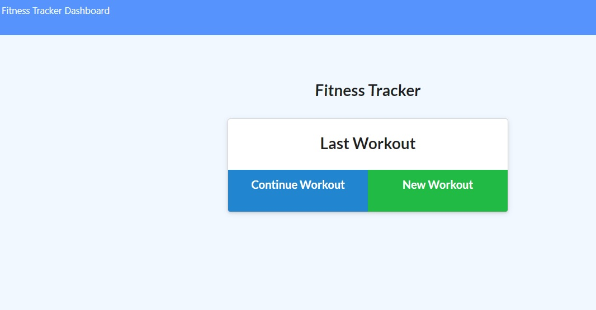

# hardlyWorkinOut
 Workout Tracker

## Description
A workout tracker with a Mongo database with a Mongoose schema and handle routes with Express.

## User Story
As a user, I want to be able to view create and track daily workouts. I want to be able to log multiple exercises in a workout on a given day. I should also be able to track the name, type, weight, sets, reps, and duration of exercise. If the exercise is a cardio exercise, I should be able to track my distance traveled.

## Preview

## Link
https://obscure-spire-10099.herokuapp.com/